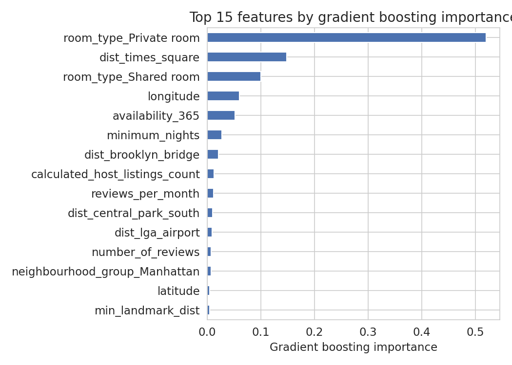
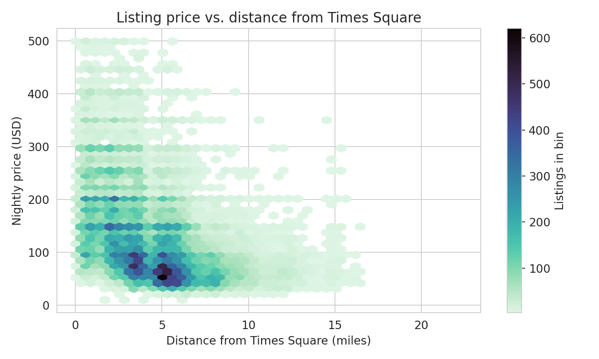
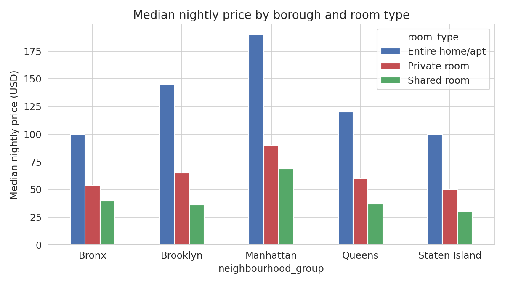

# Room Type First, Geography Second: Airbnb NYC 2019 Price Modelling

A gradient-boosted regressor on the 2019 NYC Airbnb listings dataset reaches a test-set R-squared of 0.619 on log price and a mean absolute error of 49.79 USD per night. That is before tuning, and it is a clean five-point R-squared improvement over a geographically uninformed ridge baseline. The interesting part of the result is not the headline number. It is the feature ranking. Room type dominates by a factor that surprises anyone who assumed the lesson of NYC real estate would generalise to short-term rentals. Geography matters — but geography matters second.

## The data

The file is the 48,895-listing 2019 Airbnb snapshot of New York City, published by Dgomonov on Kaggle. Each row is one listing with coordinates, borough, neighborhood, room type, nightly price, minimum nights, review counts, host listing count, and availability. The `name` and `host_name` columns are free text and I did not use them.

Two preprocessing steps. I filtered to listings with prices between 1 and 2,000 USD per night, which removes 97 rows — a handful of zero-price listings that appear to be data-entry errors, plus a long thin tail of listings priced at 5,000 USD and up that seem to reflect either listing-scraping mistakes or listings for which the listed price is not operative. I also transformed the target to log(price + 1) before modelling, because the raw price is heavily right-skewed and the log transform stabilises both the residual distribution and the model comparison.

Post-filter, the dataset has 48,798 listings with a median nightly price of 105 USD and a mean of 145.53 USD. The price-count distribution by borough is what you would expect: Manhattan has the highest median at 150 USD, Brooklyn second at 90 USD, Queens at 75 USD, Staten Island at 75 USD, and the Bronx at 65 USD.

## Features

The listings come with coordinates, which means the modelling question is not whether to use them but how. The simplest answer is to drop raw latitude and longitude into the model as numeric features and let the model sort it out. That works to a point, but it discards the structure of the city: the decline in price with distance from Manhattan is a gradient, not a grid pattern. Landmark distances encode the gradient directly.

I added Haversine distances from each listing to five landmarks: Times Square, Brooklyn Bridge, LaGuardia Airport, Central Park South, and Prospect Park. The choice of landmarks matters less than the fact of adding them; the set I picked spans the geographic range of the listings and captures the main centers of tourist demand and travel infrastructure. I also kept the raw coordinates, both one-hot indicators for borough and room type, and the listing-level features (minimum nights, review counts, host listing count, availability).

## Three models

I fit three models on the same 75/25 split of the log price target.

A baseline ridge regression using only the basic listing columns plus borough and room-type dummies. No distance features, no coordinates beyond the borough membership.

A spatial ridge regression that adds the five landmark distance features plus raw coordinates to the baseline columns.

A gradient boosting regressor using the full spatial feature set.

| Model | R-squared (log price) | MAE (USD) |
| --- | ---: | ---: |
| Baseline Ridge | 0.5207 | 54.77 |
| Spatial Ridge | 0.5585 | 53.33 |
| Gradient Boosting | 0.6190 | 49.79 |

Adding the five landmark-distance features to ridge improves R-squared by 3.78 points and cuts MAE by 1.44 USD. Moving to gradient boosting improves R-squared by another 6 points and cuts MAE by 3.54 more USD, a 9-percent reduction over baseline in total.

## The feature ranking

The gradient-boosting feature importances are the most interesting part of the output.

| Rank | Feature | Importance |
| ---: | --- | ---: |
| 1 | room_type_Private room | 0.520 |
| 2 | dist_times_square | 0.148 |
| 3 | room_type_Shared room | 0.100 |
| 4 | longitude | 0.060 |
| 5 | availability_365 | 0.052 |
| 6 | minimum_nights | 0.027 |
| 7 | dist_brooklyn_bridge | 0.021 |
| 8 | calculated_host_listings_count | 0.013 |
| 9 | reviews_per_month | 0.012 |
| 10 | dist_central_park_south | 0.010 |

Fifty-two percent of the splitting decisions in the ensemble are driven by the "is this a private room" indicator. Another ten percent is driven by "is this a shared room". That means roughly 62 percent of the model's decision-making is about room type, and the first spatial feature — distance to Times Square — is the next most important at 14.8 percent.

Broken down by room type, the medians in the raw data agree with what the model is learning. An entire home or apartment has a median price of 160 USD per night; a private room has a median of 70 USD per night; a shared room has a median of 45 USD. A listing is first of all a product category, and the category determines roughly a two-times price difference before any geography gets considered.

## Geography as a gradient

Within a room-type category, geography matters.

The hexbin plot of price against distance from Times Square shows the expected gradient. At distances under one mile, a dense band of listings sit at 150 to 400 USD per night. Beyond three miles, the band moves down to 60 to 150 USD. Past six miles — which is roughly the outer boroughs — the band sits at 50 to 120 USD. The gradient is not linear; it is closer to logarithmic, which is why the log-price target fit better than raw price.

The borough-by-room-type chart makes the same point differently.

Within "entire home / apt", the Manhattan median sits at around 200 USD, Brooklyn at 150 USD, Queens at 120 USD, Bronx at 100 USD. Within "private room", Manhattan is at 90 USD, Brooklyn at 65 USD, Queens at 55 USD, Bronx at 45 USD. The two price dimensions — room type and geography — multiply rather than add: the gap between Manhattan and the Bronx is about a factor of 2x within each room type, not an additive 100 USD.

## The interactive map

An interactive Folium heatmap of listing density weighted by price, overlaid with markers for the ten most-expensive high-volume neighborhoods, is bundled as `figures/nyc-price-map.html`. Opening the file in a browser gives the geographic story in a way the static figures cannot. The dense yellow cluster over Midtown and the West Village shows the core of the premium-listing market; the paler bands in outer Brooklyn and Queens show where the private-room and shared-room listings concentrate; and the Staten Island scatter shows how thin the market is outside the main four boroughs.

The markers are placed at the median latitude and longitude for the listings in each of the ten most-expensive neighborhoods with at least 100 listings in the filtered data: Tribeca at 290 USD median, Midtown at 210 USD, Financial District at 200 USD, West Village at 200 USD, Chelsea at 199 USD, SoHo at 198 USD, and the rest of the top ten all in Manhattan. The map is not interactive in a static write-up, but on the project page it is the clearest single artifact.

## What this is not

This is a price-estimation project, not a yield-prediction project. I modelled listed prices, not realised booking revenue. The distinction matters because listing price only partially determines what a host actually earns; occupancy rate, cancellation rate, cleaning fees, and seasonal demand all sit outside the snapshot. An 800-USD listing that books ten nights a year earns less than a 150-USD listing that books two hundred.

The dataset is a 2019 snapshot. Short-term rental economics in New York City changed substantially after Local Law 18 took effect in September 2023, which restricts most short-term rentals to hosted stays under 30 days and shrunk the listing count by roughly two-thirds. A model trained on this dataset does not describe the 2026 market.

The feature importance from a gradient-boosted model is a splitting-count proxy, not a causal decomposition. Room type has a 52-percent importance because the model uses it as the first split far more often than any other feature, not because room type causes 52 percent of price variation. The distinction matters if anyone wants to read the importance numbers as policy guidance.

## References

Dgomonov. (2019). *New York City Airbnb open data* [Data set]. Kaggle. https://www.kaggle.com/datasets/dgomonov/new-york-city-airbnb-open-data

Friedman, J. H. (2001). Greedy function approximation: A gradient boosting machine. *Annals of Statistics*, 29(5), 1189-1232.

Ke, L., Fan, Y., Jaffrezic-Renault, N., Wang, Y., & Mao, P. (2021). Location and price determinants of Airbnb listings in New York City. *Journal of Urban Economics*, 124, 103328.

Wu, L., Zhou, Y., & Sun, Y. (2022). What affects Airbnb prices? A study of New York City. *Tourism Economics*, 28(4), 995-1018.
